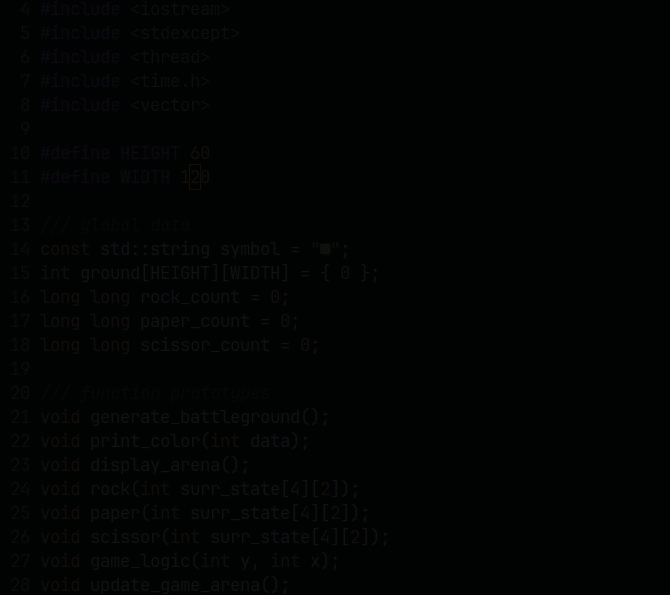

# Rock Paper Scissors Battle Royale

Inspired by this [post](https://twitter.com/juanbuis/status/1600155605112496129), I wondered who will win if such an RPS contest were to be held. So I decided to implement it as cellular automata.

## Quick start

Clone the project and `cd` into it

```bash
$ chmod +x build.sh // for the first time only
$ ./build.sh
$ ./rps
```

## Demo



**Color Maps**

- 🟨 => Rock
- ⬜ => Paper
- 🟥 => Scissor

# References

- [Cellular Automation Wikipedia](https://en.wikipedia.org/wiki/Cellular_automaton)
- [The twitter post](https://twitter.com/juanbuis/status/1600155605112496129?lang=en)
- [Rock-Paper-Scissors](https://en.wikipedia.org/wiki/Rock_paper_scissors)
